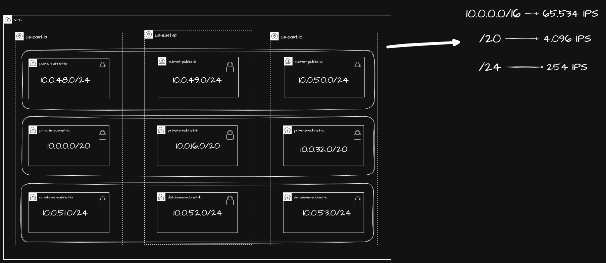
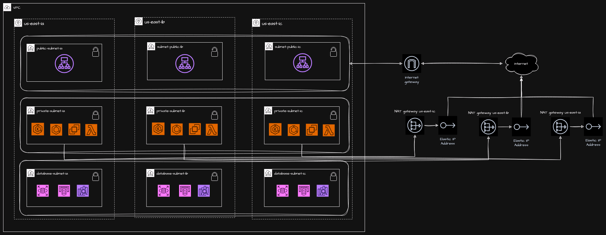

# Repositório Central de Materiais do Curso de Arquitetura de Containers na AWS da LinuxTips 

## Repositório das Aulas 

| Recurso / Aula                | Repositório                                                                                   |
|-------------------------------|-----------------------------------------------------------------------------------------------|
| VPC / Networking              | [Link do Github](https://github.com/msfidelis/linuxtips-curso-containers-vpc)                 |
| ECS + EC2                     | [Link do Github](https://github.com/msfidelis/linuxtips-curso-containers-ecs-cluster)         |
| ECS + Fargate                 | [Link do Github](https://github.com/msfidelis/linuxtips-curso-containers-ecs-cluster-fargate) |
| ECS Service Module            | [Link do Github](https://github.com/msfidelis/linuxtips-curso-containers-ecs-service-module)  |
| ECS Demo App (Mock)           | [Link do Github](https://github.com/msfidelis/linuxtips-curso-containers-ecs-app)             |
| Mirror Pudim                  | [Link do Github](https://github.com/msfidelis/linuxtips-curso-containers-ecs-service-pudim)   |
| Health API Demo               | [Link do Github](https://github.com/msfidelis/linuxtips-curso-containers-ecs-health-api-lab)  |
| Health API (Aula Roteamento)   | [Link do Github](https://github.com/msfidelis/linuxtips-curso-containers-ecs-health-api-lab/tree/aula-roteamento)  |

## Aulas ao Vivo + Abertas

| Recurso / Aula                | Repositório                                                                                   |
|-------------------------------|-----------------------------------------------------------------------------------------------|
| Live sobre ECS + Multiregion. | [Slide](https://docs.google.com/presentation/d/1AcBY7BwSOC9d9ZLM3OeacSQnieorqQEBHS_6wDGA6Ck/edit?usp=sharing) / [Live](https://www.youtube.com/live/8TYCUK_Rj7c?si=j1ZUA0axpZSWLUGN)
| Live sobre EKS + KNative. | [Slide](https://docs.google.com/presentation/d/1xdrcIRiC43UxXF4CYkPm6BK1U40fOKT4nKw0A6Ck5dw/edit?usp=sharing) / [Live](https://youtu.be/90fOQLbPPvo?si=LMjrqvGABvnmd524)
| Aula Otimização de Imagens    | [Slide](https://docs.google.com/presentation/d/1hFEZEmsO8dMC1iEryyYjfli_HCRF8xHBszF2r_araH4/edit?usp=sharing) / [Link do Github](https://github.com/msfidelis/linuxtips-curso-containers-aws-otimizacao-de-imagens) |

## Materiais Extras 

| Material                                          | Link                                                                                                                                              |
|---------------------------------------------------|---------------------------------------------------------------------------------------------------------------------------------------------------|
| Demo App: Chip                                    | [Link](https://github.com/msfidelis/chip)                                                                                                         |
| ECS Container Insights                            | [Link](https://docs.aws.amazon.com/AmazonCloudWatch/latest/monitoring/ContainerInsights.html)                                                     |
| ECS optimized AMI                                 | [Link](https://docs.aws.amazon.com/systems-manager/latest/userguide/parameter-store-public-parameters-ecs.html)                                   |
| Amazon ECR                                        | [Link](https://aws.amazon.com/pt/ecr/)                                                                                                            |
| Amazon ECS Workshop                               | [Link](https://ecsworkshop.com/)                                                                                                                  |
| Amazon ECS Task Placement                         | [Link](https://docs.aws.amazon.com/AmazonECS/latest/developerguide/task-placement-strategies.html)                                                |
| K6 Load Tests                                     | [Link](https://grafana.com/docs/k6/latest/using-k6/http-requests/)                                                                                |
| Cloudwatch - MetricAlarm                          | [Link](https://docs.aws.amazon.com/AmazonCloudWatch/latest/APIReference/API_MetricAlarm.html)                                                     |
| Cloudwatch Metrics Load balancer                  | [Link](https://docs.aws.amazon.com/elasticloadbalancing/latest/application/load-balancer-cloudwatch-metrics.html#load-balancer-metrics-alb)       |
| Appautoscaling Target tracking scaling policies   | [Link](https://docs.aws.amazon.com/autoscaling/application/userguide/application-auto-scaling-target-tracking.html)                               |
| Appautoscaling PredefinedMetricSpecification      | [Link](https://docs.aws.amazon.com/autoscaling/application/APIReference/API_PredefinedMetricSpecification.html)                                   |
| Appautoscaling CustomizedMetricSpecification      | [Link](https://docs.aws.amazon.com/autoscaling/ec2/APIReference/API_CustomizedMetricSpecification.html)                                           |
| Firecracker                                       | [Link](https://firecracker-microvm.github.io/)                                                                                                    | 
| Fargate Pricing Calculator                        | [Link](https://cloudtempo.dev/fargate-pricing-calculator)                                                                                         |
| Fargate Tasks Size                                | [Link](https://docs.aws.amazon.com/AmazonECS/latest/developerguide/fargate-tasks-services.html#fargate-tasks-size)                                | 
| Amazon Elastic File System                        | [Link](https://aws.amazon.com/pt/efs/)                                                                                                            | 
| Amazon EFS Performance                            | [Link](https://docs.aws.amazon.com/efs/latest/ug/performance.html)                                                                                | 
| Sensitive data using Secrets Manager in ECS       | [Link](https://docs.aws.amazon.com/AmazonECS/latest/developerguide/specifying-sensitive-data-tutorial.html)                                       | 
| AWS Secrets Manager vs Parameter Store            | [Link](https://tutorialsdojo.com/aws-secrets-manager-vs-systems-manager-parameter-store/)                                                         |
| CloudMap - Service Discovery                      | [Link](https://aws.amazon.com/pt/cloud-map/)                                                                                                      |
| Chainguard - Painless Vulnerability Management    | [Link](https://courses.chainguard.dev/vulnerability-management-certification)                                                                     |

## Github Actions Úteis para Containers na AWS

| Nome                                    | Descrição                                                      | Link                                                                                  |
|-----------------------------------------|----------------------------------------------------------------|---------------------------------------------------------------------------------------|
| GolangCI                                | Um linter para Go                                              | [GolangCI](https://github.com/golangci/golangci-lint)                                 |
| Gofmt                                   | Ação para formatar código Go                                   | [Gofmt](https://github.com/Jerome1337/gofmt-action)                                   |
| Actions/Checkout                        | Ação para fazer checkout de um repositório                     | [Actions/Checkout](https://github.com/actions/checkout)                               |
| Setup Terraform                         | Ação para configurar o CLI do Terraform                        | [Setup Terraform](https://github.com/hashicorp/setup-terraform)                       |
| Terraform Docs                          | Gerar documentação para módulos Terraform                      | [Terraform Docs](https://github.com/Dirrk/terraform-docs)                             |
| AWS Actions/Render Task Definitions     | Renderizar templates de definição de tarefa do ECS             | [AWS Actions/Render Task Definitions](https://github.com/aws-actions/amazon-ecs-render-task-definition) |
| AWS Actions/Deploy Task Definitions     | Fazer deploy de definições de tarefa do ECS                    | [AWS Actions/Deploy Task Definitions](https://github.com/aws-actions/amazon-ecs-deploy-task-definition) |
| AWS Actions/Configure AWS Credentials   | Configurar variáveis de ambiente de credenciais AWS            | [AWS Actions/Configure AWS Credentials](https://github.com/aws-actions/configure-aws-credentials) |
| AWS Actions/ECR Login                   | Fazer login no Amazon ECR                                      | [AWS Actions/ECR Login](https://github.com/aws-actions/amazon-ecr-login)              |
| AWS Actions/Get Secrets                 | Recuperar segredos do AWS Secrets Manager                      | [AWS Actions/Get Secrets](https://github.com/aws-actions/aws-secretsmanager-get-secrets) |
| Docker Setup BuildX                     | Configurar Docker BuildX                                       | [Docker Setup BuildX](https://github.com/docker/setup-buildx-action)                 |
| AWS Assume Role                         | Assumir um papel IAM da AWS                                    | [AWS Assume Role](https://github.com/nordcloud/aws-assume-role/)                      |
| Phonito Docker Scan Image               | Escanear imagens Docker para vulnerabilidades                  | [Phonito Docker Scan Image](https://github.com/phonito/phonito-scanner-action)        |
| Anchore - Grype Container Scan          | Escanear imagens de contêiner para vulnerabilidades usando Grype| [Anchore - Grype Container Scan](https://github.com/anchore/scan-action)              |
| Snyk Security Scan                      | Escanear vulnerabilidades de segurança usando Snyk             | [Snyk Security Scan](https://github.com/snyk/actions)                                 |
| Awesome Actions List                    | Uma lista curada de ações incríveis                            | [Awesome Actions List](https://github.com/sdras/awesome-actions)                      |
| S3 Sync                                 | Sincronizar arquivos e diretórios com o S3                     | [S3 Sync](https://github.com/jakejarvis/s3-sync-action)                               |

## VPC / Networking

### Planejamento de Ranges da VPC Otimizada para Containers 

### Planejamento de Uso e Componentes de Rede

## ECS 

### Versões do Modulo Desenvolvido em Aula

| Versão / Tag |  Descrição                                                                                                                                                                                                                                 |
|--------------|--------------------------------------------------------------------------------------------------------------------------------------------------------------------------------------------------------------------------------------------|
| [v1](https://github.com/msfidelis/linuxtips-curso-containers-ecs-service-module/tree/v1)              | Publicação inicial do modulo de ECS. Tudo que foi desenvolvido em aula até a aula de pipelines com Github Actions foi empacotado nessa versão     |
| [v1.1.0](https://github.com/msfidelis/linuxtips-curso-containers-ecs-service-module/tree/v1.1.0)      | Adicionado Suporte a montagem de volumes do Amazon EFS                                                                                            |
| [v1.2.0](https://github.com/msfidelis/linuxtips-curso-containers-ecs-service-module/tree/v1.2.0)      | Adicionando suporte a injeção de variáveis de ambiente vindas do Parameter Store e Secrets Manager                                                |
